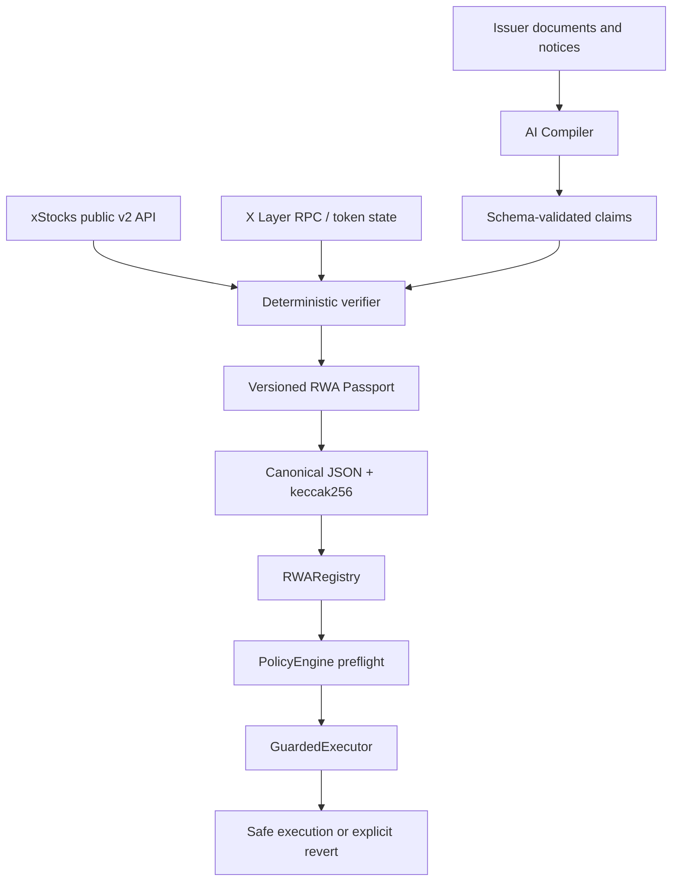

# RWA Compiler

**The preflight layer between real-world complexity and onchain execution.**

[**Open the live app →**](https://rwa-compiler.meboebube48.chatgpt.site)

RWA Compiler turns identity, backing, reserves, prices, multipliers, corporate actions, market state, and provenance into versioned RWA Passports. Applications and agents ask one deterministic question before capital moves:

```text
preflight(asset = NVDAx, action = SWAP) → ALLOW | WATCH | PAUSE
```


## Verified status

| Surface | Status |
| --- | --- |
| Web application | [Public production deployment](https://rwa-compiler.meboebube48.chatgpt.site) verified over HTTPS |
| Live xStocks data | Public v2 Assets, Price, Multiplier, and Proof-of-Reserves adapters verified |
| X Layer mainnet reads | Chain ID 196, NVDAx bytecode, and `getCurrentMultiplier()` read verified |
| X Layer testnet reads | Chain ID 1952 verified |
| RWA Compiler testnet contracts | Ready; deployment blocked by missing funded deployer key |
| RWA Compiler mainnet contracts | Blocked until testnet smoke tests pass and a funded key is confirmed |
| AI provider | OpenAI-compatible implementation complete; live extraction requires `AI_API_KEY` |

No address, transaction, partnership, or AI call is claimed unless independently verified.

## What it does

- Compiles real xStocks public data into a strict, versioned Passport.
- Tracks provenance and content hashes for every material claim.
- Lets AI extract candidate corporate-action claims from untrusted text.
- Validates model output and compares it with authoritative xStocks sources.
- Applies deterministic ALLOW / WATCH / PAUSE policy; the LLM never authorizes execution.
- Anchors compact Passport state on X Layer and proves enforcement with a non-custodial guarded action.
- Includes a clearly labeled simulator for NORMAL → WATCH → PAUSE → UPDATED → NORMAL.

## Why it matters

Tokenized RWAs are onchain, but their operational meaning remains scattered across issuer documents, APIs, reserve reports, schedules, oracle state, and contracts. A token address and price are not enough context for an autonomous agent. Corporate actions can update token multipliers at a known activation time; official xStocks guidance recommends pausing briefly around activation. RWA Compiler makes that state machine-readable and enforceable.

## Demo

Open the [live terminal](https://rwa-compiler.meboebube48.chatgpt.site/terminal), inspect the [NVDAx Passport](https://rwa-compiler.meboebube48.chatgpt.site/asset/NVDAx), run the [compiler](https://rwa-compiler.meboebube48.chatgpt.site/compiler), then start the [corporate-action demo](https://rwa-compiler.meboebube48.chatgpt.site/demo). ALLOW and WATCH actions succeed; PAUSE returns the exact guarded-action rejection reason. See [DEMO_SCRIPT.md](DEMO_SCRIPT.md) for the 90–120 second judging sequence.

## Architecture



## AI and verification

`src/lib/ai/compiler.ts` implements an OpenAI-compatible provider boundary. The system instruction treats documents as hostile data, ignores embedded instructions, requests JSON only, and validates the result with Zod. Without a key, the app returns an explicitly labeled deterministic development extraction—never fixture output presented as live AI.

Official structured data wins. The verifier checks asset identity, X Layer deployment, multiplier state, proof-of-reserves freshness, halt state, and conflicts. Unavailable critical sources fail safe. The MVP publisher is an authorized updater; it is not presented as decentralized.

## Passport and policy

The `1.0.0` Passport schema lives in `src/lib/passport/schema.ts`. Objects are recursively key-sorted before `keccak256`, so the API, frontend, and registry share one deterministic hash. Hard pause conditions precede watch conditions. WATCH remains operational; PAUSE blocks guarded execution. Defaults are 15 minutes before/after multiplier activation with a 24-hour watch horizon.

Read [RWA Passport](docs/RWA-PASSPORT.md), [Policy Engine](docs/POLICY-ENGINE.md), and [AI Verification](docs/AI-VERIFICATION.md).

## Smart contracts

- `RWARegistry.sol`: asset registration, updater authorization, compact Passport state, status/reason events, emergency pause.
- `PolicyEngine.sol`: unknown, expired, emergency, ALLOW, WATCH, and PAUSE evaluation.
- `GuardedExecutor.sol`: minimal non-custodial enforcement; no arbitrary calls or user funds.

Foundry tests cover registration, updates, authorization, transitions, ALLOW/WATCH/PAUSE, expiry, emergency pause, invalid inputs, event emission, success, and revert. `npm run test:contracts` compiles every contract and test with solc 0.8.26.

## X Layer

| Network | Chain ID | RPC | Explorer | RWA Compiler deployment |
| --- | ---: | --- | --- | --- |
| Testnet | 1952 | `https://testrpc.xlayer.tech/terigon` | [Explorer](https://www.okx.com/web3/explorer/xlayer-test) | `NOT_DEPLOYED` — funded key required |
| Mainnet | 196 | `https://rpc.xlayer.tech` | [Explorer](https://www.okx.com/web3/explorer/xlayer) | `NOT_DEPLOYED` — testnet verification first |

The live smoke script verified the official NVDAx X Layer deployment at `0xc845b2894dbddd03858fd2d643b4ef725fe0849d` has bytecode and responds to its documented multiplier method. This is the xStock token, not an RWA Compiler contract.

## xStocks integration

Only current public v2 paths are used:

- `/public/assets/{symbol}`
- `/public/assets/{symbol}/price-data`
- `/public/assets/{symbol}/multiplier?network=XLayer`
- `/public/proof-of-reserves/{symbol}`

On August 18, 2026, the Assets API reported X Layer deployments for NVDAx, AAPLx, and TSLAx, so they form the recognizable default set. The adapter is generic and never substitutes fixtures when live data fails.

## Local development

```bash
npm install
cp .env.example .env.local
npm run dev
```

Node.js 22.13+ is required. Foundry is optional for native Solidity tests. `AI_API_KEY` and `DEPLOYER_PRIVATE_KEY` are server/CLI only and must never use `NEXT_PUBLIC_`.

## Validation

```bash
npm run lint
npm run typecheck
npm run test
npm run test:contracts
npm run test:render
node scripts/smoke-live.mjs
forge test -vvv
```

Current verified results: lint clean; TypeScript clean; 7/7 unit tests; 7 Solidity contracts/interfaces compiled; 3/3 production render/metadata smoke tests; production build successful; live xStocks/API and X Layer RPC smoke successful. Native `forge test` is pending because Foundry is unavailable in this Windows environment.

## API

| Method | Path | Purpose |
| --- | --- | --- |
| GET | `/api/assets` | Preferred live Passport set |
| GET | `/api/assets/:symbol` | Live compiled asset and hash |
| GET | `/api/assets/:symbol/passport` | Canonical Passport payload |
| POST | `/api/preflight` | Deterministic action policy |
| POST | `/api/compiler` | AI extraction plus deterministic verification |
| GET | `/api/health` | Service and AI configuration status |

See [OpenAPI](docs/openapi.yaml), [Architecture](docs/ARCHITECTURE.md), [Security](docs/SECURITY.md), and [Deployment](docs/DEPLOYMENT.md).

## Limitations

- Authorized updater trust remains in the MVP.
- Public source availability affects freshness.
- RWA Compiler contract deployment requires the user's funded wallet.
- Live AI requires a configured provider key.
- Tokenized assets can carry jurisdictional restrictions.
- This infrastructure does not replace issuer/protocol compliance and is not investment advice.

## Roadmap

1. xStocks/tokenized equities.
2. Tokenized treasuries and funds.
3. Common Passport adapter SDK.
4. Wallet, DEX, lending, and agent integrations.
5. Decentralized updater/verifier network.

## Hackathon

Built for the X Layer Build X — AI Season Hackathon, targeting the Hackathon Grant and AI-RWA Liquidity Grant. The project is **built on X Layer** and **integrates public xStocks data**; it does not claim an official partnership or manufacture trading volume.

MIT licensed. See [LICENSE](LICENSE).

