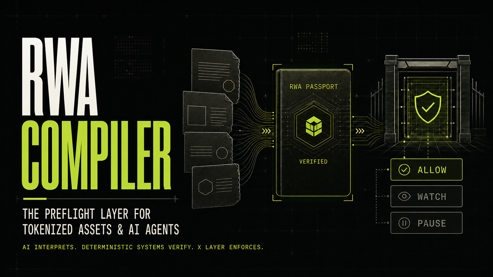
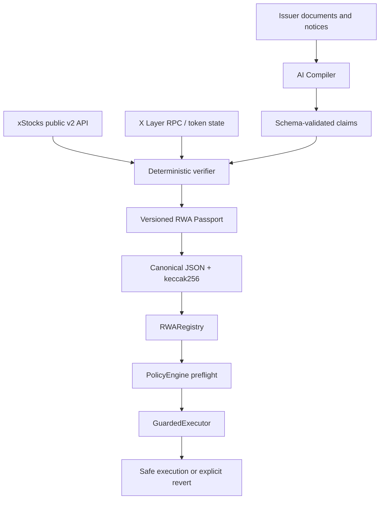

# RWA Compiler

**The preflight layer between real-world complexity and onchain execution.**

RWA Compiler turns identity, backing, reserves, prices, multipliers, corporate actions, market state, and provenance into versioned RWA Passports. Applications and agents ask one deterministic question before capital moves:

```text
preflight(asset = NVDAx, action = SWAP) → ALLOW | WATCH | PAUSE
```



## Submission status

| Surface | Status |
| --- | --- |
| Web application | Production build verified; public URL pending hosting authentication |
| Live xStocks data | Verified against public v2 Assets, Price, Multiplier, and Proof-of-Reserves endpoints |
| X Layer testnet | Contracts ready; deployment pending a funded deployer key |
| X Layer mainnet | Blocked until testnet smoke tests pass and a funded deployer key is confirmed |
| AI provider | OpenAI-compatible implementation complete; live extraction requires `AI_API_KEY` |

No address, transaction, deployment, partnership, or production URL is claimed until independently verified.

## What it does

- Compiles real xStocks public data into a strict, versioned Passport.
- Tracks provenance and canonical content hashes for every material claim.
- Lets an AI provider extract candidate corporate-action claims from untrusted text.
- Validates all model output and compares it with authoritative xStocks sources.
- Applies deterministic ALLOW / WATCH / PAUSE policy; the LLM never authorizes execution.
- Anchors compact Passport state on X Layer and proves enforcement with a non-custodial guarded action.
- Includes a clearly labeled synthetic simulator for NORMAL → WATCH → PAUSE → UPDATED → NORMAL.

## The problem

Tokenized real-world assets are onchain, but much of what makes them safe to use remains fragmented across issuer documents, APIs, reserve reports, market schedules, corporate actions, oracle state, and token contracts. Token address plus price is not enough context for an autonomous agent.

## Why RWA context matters

Corporate actions can update token multipliers at a known activation time. Official xStocks guidance recommends that venues pause briefly around activation to avoid unexpected settlement behavior. RWA Compiler makes that operational context machine-readable and enforceable.

## Demo

Open `/demo`, start the synthetic TSLAx split, and attempt the guarded action at each stage. ALLOW and WATCH succeed; PAUSE returns the exact Solidity-style rejection reason. See [DEMO_SCRIPT.md](DEMO_SCRIPT.md) for the 90–120 second judging sequence.

## Architecture



## How AI is used

`src/lib/ai/compiler.ts` implements an OpenAI-compatible provider boundary. Its system instruction treats documents as hostile data, ignores embedded instructions, requests JSON only, and validates the result with Zod. Without a key, the app boots and returns an explicitly labeled deterministic development extraction. It never represents fixtures as live AI.

## Verification model

Official structured data wins. The verifier checks asset identity, X Layer deployment, pending multiplier state, proof-of-reserves freshness, trading halt state, and conflicts. Unavailable critical sources fail safe. The MVP publisher is an authorized updater; it is not presented as decentralized.

## RWA Passport

The `1.0.0` schema lives in `src/lib/passport/schema.ts`. Equivalent objects are key-sorted before `keccak256`, so the API, frontend, and registry share one deterministic manifest hash. See [docs/RWA-PASSPORT.md](docs/RWA-PASSPORT.md).

## Preflight protocol

Hard pause conditions take precedence over watch conditions. WATCH remains operational; PAUSE blocks the guarded action. Default corporate-action thresholds are 15 minutes before and after activation, with a 24-hour watch horizon. See [docs/POLICY-ENGINE.md](docs/POLICY-ENGINE.md).

## Smart contracts

- `RWARegistry.sol`: asset registration, updater authorization, compact Passport state, status/reason events, emergency pause.
- `PolicyEngine.sol`: unknown, expired, emergency, ALLOW, WATCH, and PAUSE evaluation.
- `GuardedExecutor.sol`: minimal non-custodial enforcement proof; no arbitrary calls or user funds.

Foundry tests cover registration, updates, authorization, transitions, ALLOW/WATCH/PAUSE, expiry, emergency pause, invalid inputs, event emission, success, and revert. `npm run test:contracts` additionally compiles every Solidity source with solc 0.8.26.

## X Layer deployments

Official network configuration used by this repository:

| Network | Chain ID | RPC | Explorer | Deployment |
| --- | ---: | --- | --- | --- |
| X Layer Testnet | 1952 | `https://testrpc.xlayer.tech/terigon` | [Explorer](https://www.okx.com/web3/explorer/xlayer-test) | Not deployed; funded key required |
| X Layer Mainnet | 196 | `https://rpc.xlayer.tech` | [Explorer](https://www.okx.com/web3/explorer/xlayer) | Not deployed; requires successful testnet smoke test first |

Verified deployment manifests belong in `deployments/`. Placeholder files are explicitly marked `NOT_DEPLOYED`.

## xStocks integration

The adapter uses only current public v2 paths under `https://api.backed.fi/api/v2`:

- `/public/assets/{symbol}`
- `/public/assets/{symbol}/price-data`
- `/public/assets/{symbol}/multiplier?network=XLayer`
- `/public/proof-of-reserves/{symbol}`

On August 18, 2026, the official Assets API reported X Layer deployments for NVDAx, AAPLx, and TSLAx, so they are the default recognizable demo set. The adapter is generic and never silently substitutes fixture data for a failed live request.

## Local development

Requirements: Node.js 22.13+, npm, and optionally Foundry for native contract tests.

```bash
npm install
cp .env.example .env.local
npm run dev
```

Then open `http://localhost:3000`.

## Environment variables

Copy `.env.example`. `AI_API_KEY` and `DEPLOYER_PRIVATE_KEY` are server/CLI only and must never use the `NEXT_PUBLIC_` prefix. The app works without either key; unavailable features are labeled honestly.

## Tests

```bash
npm run lint
npm run typecheck
npm run test
npm run test:contracts
npm run build
forge test -vvv
```

## API

| Method | Path | Purpose |
| --- | --- | --- |
| GET | `/api/assets` | Preferred live Passport set |
| GET | `/api/assets/:symbol` | Live compiled asset and hash |
| GET | `/api/assets/:symbol/passport` | Canonical Passport payload |
| POST | `/api/preflight` | Deterministic action policy |
| POST | `/api/compiler` | AI extraction plus deterministic verification |
| GET | `/api/health` | Service and AI configuration status |

OpenAPI is in [docs/openapi.yaml](docs/openapi.yaml).

## Security model

External text is untrusted data. Model output is bounded and validated. URLs are not fetched from compiler input. API calls have timeouts and short caching. Contracts separate owner and updater, reject invalid/expired state, and expose emergency pause. See [docs/SECURITY.md](docs/SECURITY.md).

## Limitations

- Authorized updater trust remains in the MVP.
- Public source freshness and availability affect policy.
- Onchain X Layer deployment requires the user's funded wallet.
- Live AI extraction requires a configured provider key.
- Tokenized assets may have jurisdictional restrictions.
- This informational infrastructure does not replace issuer/protocol compliance systems and is not investment advice.

## Roadmap

1. xStocks/tokenized equities.
2. Tokenized treasuries and funds.
3. Common Passport adapter SDK.
4. Wallet, DEX, lending, and agent integrations.
5. Decentralized updater/verifier network.

## Hackathon

Built for the X Layer Build X — AI Season Hackathon, targeting the Hackathon Grant and AI-RWA Liquidity Grant. The project is **built on X Layer** and **integrates public xStocks data**; it does not claim an official partnership.

## License

MIT. See [LICENSE](LICENSE).

